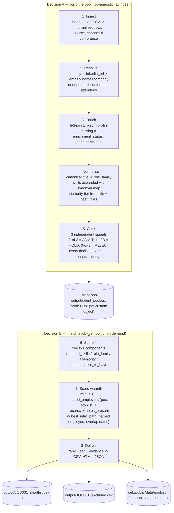

# Flow — pipeline stages and schema at each step

> The brief explicitly asks: *"map out what your pipeline does at each step: what goes in, what
> happens, and what comes out."* This is that map.

## The two-decision split (one paragraph)

Decision **A** runs once, at ingestion, and is job-agnostic — its answer is *"is this person talent
in a domain we hire in?"* Decision **B** runs on demand for a specific `job_id` against the clean
pool built by A — its answer is *"who should the recruiter call this week?"* Everything expensive
(enrichment, normalisation, gating) happens once **per person** rather than once per **person × job**.
That is also the answer to the scale question in the design doc.

## Big picture



## Where the mock adapters plug in

Every arrow crossing a real system boundary is fronted by an adapter in `src/integrations/` that
implements the interface of the real API and **logs the call it would make**. Same interface,
different backend — the swap to production is a one-file change per integration.

```
S1  Ingest       <-- mock_badge_scan     (real: Cvent / Swapcard export)
S3  Enrich       <-- mock_enrichment     (real: Proxycurl / PDL)  [cache + miss rate + credit counter]
POOL             <-- mock_hubspot        (real: HubSpot CRM v3 write-back)
S6  jobs list    <-- mock_comeet         (real: Comeet ATS)
S6  dedupe       <-- mock_comeet         (real: candidate status lookup)
S7  outreach     <-- mock_notifier       (real: Slack chat.postMessage / SendGrid)
S8  prose        <-- mock_narrator       (real: single Claude call over the same evidence dict)
```

## Schema at each stage

Row shape after each stage (only the fields that change or become newly available are listed).

### After S1 — Ingest

```
hubspot_id, full_name, email, company, title, conference_name, conference_domain,
conference_date, source_channel="conference", notes, linkedin_url,
_ingested_at
```

Whitespace trimmed. Case preserved for display; a lowercased `title_norm` added for matching.

### After S2 — Resolve

```
+ person_id            stable id survived across multiple conferences
+ merged_from          list of hubspot_ids that resolved to this person
+ conferences_attended [{name, domain, date}]
```

Resolution priority: `linkedin_url` > `email` > `(full_name lowercased, company lowercased)`.

### After S3 — Enrich

```
+ enrichment_status    "full" | "partial" | "none"
+ current_company, current_title, location, years_experience
+ top_skills (list), industry
+ past_companies (list), past_titles (list of {title, employer, start, end})
+ wsc_mutual_connections (list of employee_ids)
+ _enrichment_ts
```

Missing profile = `enrichment_status: none`, all LinkedIn fields null, not an error.

### After S4 — Normalise

```
+ title_canonical      one of: senior_ml_engineer, cv_engineer, data_engineer, backend_engineer, ...
+ role_family          one of: ml_cv | ml_general | data_engineering | data_analytics |
                                backend | platform_devops | video_broadcast | product |
                                sales_engineering | not_talent
+ skills_expanded      list of canonical skill tokens after synonym expansion
+ employer_tokens      list of past_companies AFTER stoplist filter + alias unification
+ seniority_tier       int (see title_tiers in scoring.yaml)
```

### After S5 — Gate

```
+ gate.signals.role_family_ok      bool  (family != not_talent AND != unknown)
+ gate.signals.skills_evidence_ok  bool  (skills belong to the claimed family)
+ gate.signals.proximity_ok        bool  (industry OR any past_company hits sports/media lexicon
                                          OR conference_domain matches family's domain expectation)
+ gate.decision                    "ADMIT" | "HOLD" | "REJECT"
+ gate.reason                      short human string, e.g.
                                   "3/3 signals: CV title, CV skill stack, video-tech industry"
                                   "0/3 signals: IT Manager title, ITIL skills, healthcare industry"
+ domain_relevance_score           0-100 (transparent aggregate of the 3 signals)
+ data_confidence                  "high" | "medium" | "low" (drives fit ceiling on low)
```

Everything in the `HOLD`/`REJECT` buckets stays retrievable — that is the auditability guarantee.

### After S6 — Score fit  (per candidate × job)

Every component is **0.0–1.0 and weight-independent**. Weights apply in the final aggregation.

```
fit.components = {
  required_skills : float 0..1   # matched / total required, exact = 1.0, family = 0.6
  role_family     : float 0..1   # exact = 1.0, adjacent = 0.5, other = 0.0
  seniority       : float 0..1   # band fit, see scoring.yaml
  domain          : float 0..1   # sports/media lexicon hits on industry + employers + skills
  nice_to_have    : float 0..1
}
fit.score_default : float 0..100    # ships in the JSON; browser must reproduce to 1dp
fit.matched_required, missing_required, matched_nice_to_have : lists
fit.seniority_flag : "in_band" | "above_band" | "below_band"
fit.excluded       : null OR { stage:"hard_requirement", reason:"..." }
```

### After S7 — Score warmth (per candidate × job)

```
warmth.components = {
  mutual_connections : float 0..1  # diminishing-returns curve, same-dept weighted
  shared_employer    : float 0..1  # after stoplist + alias unification
  recency            : float 0..1  # exp decay on conference_date, half-life 12 months
  notes_present      : float 0..1  # 1.0 if notes non-empty else 0.0
}
warmth.score_default : float 0..100
warmth.mutuals            : [{employee_id, name, title, department, same_department}]
warmth.shared_employers   : [{employer_canonical, employee_id, name, overlap_years}]
warmth.best_intro_path    : "Maya Levi (Sr ML Engineer) — overlapped at Mobileye 2019-21"
```

### After S8 — Deliver

Three artefacts, one code path:

```
output/JOB001_shortlist.csv   26 columns from docs/04-output-spec.md
output/JOB001_shortlist.html  self-contained recruiter view, no build step
output/JOB001_excluded.csv    every gate-reject and hard-req-fail, with reason
output/talent_pool.csv        the pool after Decision A (Comeet-style write-back preview)
web/public/data/pool.json     the app's data contract (contract in docs/08-web-app.md)
```

## The parity invariant (JSON contract → browser)

Every candidate ships with `fit.components` (five 0-1 values) and `fit.score_default` (0-100).
The browser recomputes:

```
score = Σ (components[k] × weights[k]) / Σ weights[k]  × 100
```

With default weights this must equal `score_default` to 1 decimal place. Asserted in
`tests/test_json_parity.py` **and** in a dev-mode invariant check on the client. Same rule for
warmth.

## Non-obvious data hazards handled here

Pointers only — full context in `docs/01-data-findings.md`.

- **`conference_domain`** is undocumented in the brief but present in the CSV. Used by S5 signal 3.
- **`past_titles`** is undocumented. Used by S4 for seniority trajectory + S7 for overlap dates.
- **`work_history`** on the employees is undocumented. Used entirely by S7's shared-employer path;
  the "Grace Wilson" demo row (no mutuals, real IDF shared unit) is invisible without it.
- **Generic employer tokens** — `startup`, `freelance`, `university`, `IDF`, `public sector`,
  `hospital group` — appear on both sides and would generate ~40 false warm paths without a
  stoplist. See `config/taxonomy.yaml` § `generic_employer_stoplist`.
- **Company aliases** — `Opta / Opta Sports / Stats Perform`, `IDF / IDF Intelligence Unit /
  IDF tech unit` — need unification for the real overlaps to surface. See `company_aliases`.
